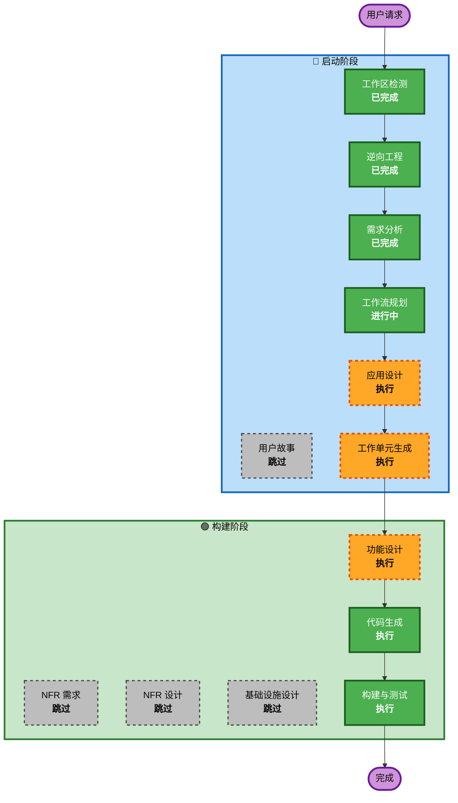

# 执行计划

## 详细分析摘要

### 变更范围
- **变更类型**: 多组件功能增强（两个独立功能模块）
- **主要变更**: 新增 Bedrock Provider 客户端 + 增强 Multi-Agent 编排能力
- **涉及组件**: api/、config/、swarm/、coordinator/、engine/

### 变更影响评估
- **用户可见变更**: 是 — 新增 Provider 选项，新增多 agent 协作能力
- **结构变更**: 是 — 新增 bedrock_client.py，增强 swarm 通信层
- **数据模型变更**: 是 — 新增结构化消息类型、共享上下文模型
- **API 变更**: 否 — 遵循现有 SupportsStreamingMessages 协议
- **NFR 影响**: 是 — 安全性（AWS 凭证）、性能（流式响应）

### 风险评估
- **风险等级**: 中等
- **回滚复杂度**: 简单（新增模块，不修改核心接口）
- **测试复杂度**: 中等（需 mock AWS 服务）

## 工作流可视化

## 阶段执行计划

### 🔵 启动阶段
- [x] 工作区检测（已完成）
- [x] 逆向工程（已完成）
- [x] 需求分析（已完成）
- [x] 用户故事 — 跳过
  - **理由**: 技术性功能增强，无复杂用户交互场景
- [x] 工作流规划（进行中）
- [x] 应用设计 — 执行
  - **理由**: 需要设计 Bedrock 客户端组件和 Multi-Agent 增强的组件交互
- [x] 工作单元生成 — 执行
  - **理由**: 两个独立功能模块需拆分为独立工作单元

### 🟢 构建阶段（按工作单元循环）
- [x] 功能设计 — 执行
  - **理由**: Bedrock API 集成和 Multi-Agent 消息模型需要详细设计
- [ ] NFR 需求 — 跳过
  - **理由**: 现有技术栈已确定，NFR 需求已在需求文档中覆盖
- [ ] NFR 设计 — 跳过
  - **理由**: 无额外 NFR 模式需要设计
- [ ] 基础设施设计 — 跳过
  - **理由**: 无基础设施变更，纯应用层代码
- [x] 代码生成 — 执行（始终）
  - **理由**: 需要实现代码
- [ ] 构建与测试 — 执行（始终）
  - **理由**: 需要构建和测试验证

## 工作单元规划
- **Unit 1**: Bedrock Provider（api/bedrock_client.py、registry 更新、config 更新）
- **Unit 2**: Multi-Agent 增强（swarm/ 通信增强、coordinator/ 任务拆分）

## 成功标准
- Bedrock Provider 能通过 `oh --model bedrock/claude-3-sonnet` 正常调用
- Multi-Agent 能自动拆分任务并通过结构化消息协作
- 所有新增代码通过 ruff + mypy strict 检查
- 单元测试覆盖核心逻辑
